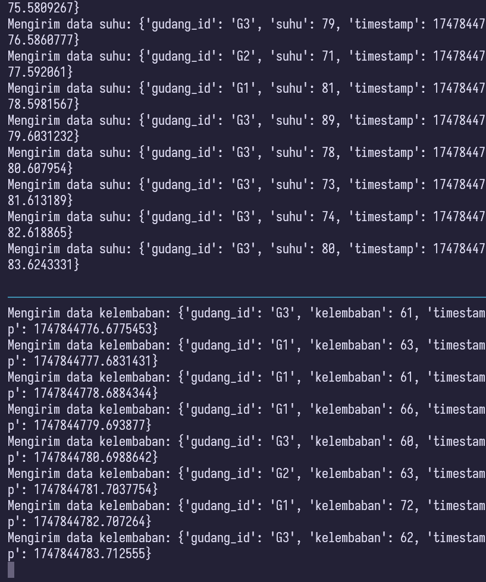

# Big Data A : Kafka + Spark Problem Based Learning

Nama | NRP
---|---
Amoes Noland | 5027231028

## Daftar Isi

- [Big Data A : Kafka + Spark Problem Based Learning](#big-data-a--kafka--spark-problem-based-learning)
  - [Daftar Isi](#daftar-isi)
  - [Latar Belakang](#latar-belakang)
  - [Pengerjaan](#pengerjaan)
    - [1. Pembuatan Topik Kafka](#1-pembuatan-topik-kafka)
    - [2. Simulasi Data Sensor (Kafka Producer)](#2-simulasi-data-sensor-kafka-producer)
    - [3. Pengolahan Data (Kafka Consumer)](#3-pengolahan-data-kafka-consumer)
    - [4. Gabungkan Stream dari Dua Sensor](#4-gabungkan-stream-dari-dua-sensor)

## Latar Belakang

Sebuah perusahaan logistik mengelola beberapa gudang penyimpanan yang menyimpan barang sensitif seperti makanan, obat-obatan, dan elektronik. Untuk menjaga kualitas penyimpanan, gudang-gudang tersebut dilengkapi dengan dua jenis sensor:

* Sensor Suhu
* Sensor Kelembaban

Sensor akan mengirimkan data setiap detik. Perusahaan ingin memantau kondisi gudang secara real-time untuk mencegah kerusakan barang akibat suhu terlalu tinggi atau kelembaban berlebih.

## Pengerjaan

### 1. Pembuatan Topik Kafka

```
Buat dua topik di Apache Kafka:
  * sensor-suhu-gudang
  * sensor-kelembaban-gudang
Topik ini akan digunakan untuk menerima data dari masing-masing sensor secara real-time.
```

Untuk menjalankan kafka saya menggunakan Docker image dari Confluent Inc. yang memiliki versi kecil dari infrastruktur Kafka untuk edukasi. Sehingga saya langsung hubungkan ke sebuah [docker-compose.yml](docker-compose.yml) yang menyiapkan segala bagian yang diperlukan untuk broker Kafka.

Spesifikasi Port yang digunakan adalah sebagai berikut:

* Zookeeper:
  * 2181: untuk menjalankan Kafka
* Kafka:
  * 29092:29092: localhost:29092 untuk producer/consumer yang berjalan di host.
  * 9092:9092: Port 9092 di container Kafka, untuk internal Docker


Lalu, untuk membuat topik perlu dijalankan beberapa command dalam terminal:
```sh
# Nyalakan docker container
docker-compose up -d

# Buat dua topik
docker-compose exec kafka kafka-topics --create --topic sensor-suhu-gudang --bootstrap-server localhost:9092 --partitions 1 --replication-factor 1
docker-compose exec kafka kafka-topics --create --topic sensor-kelembaban-gudang --bootstrap-server localhost:9092 --partitions 1 --replication-factor 1

# Cek ulang bila topik sudah ada
docker-compose exec kafka kafka-topics --list --bootstrap-server localhost:9092
```

Bila dilihat menggunakan `docker exec` akan terlihat bahwa kedua topik berhasil dibuat di dalam container:


### 2. Simulasi Data Sensor (Kafka Producer)

```
Buat dua Kafka producer terpisah:
a. Producer Suhu
  Kirim data setiap detik
  Format:
  {"gudang_id": "G1", "suhu": 82}

b. Producer Kelembaban
  Kirim data setiap detik
  Format:
  {"gudang_id": "G1", "kelembaban": 75}

Gunakan minimal 3 gudang: G1, G2, G3.
```

Menggunakan `kafka-python`, dapat disimulasikan Kafka Producer untuk data suhu dan kelembaban ke dalam broker yang sudah disiapkan pada tahap sebelumnya.

* [Producer Suhu](pub/producer_suhu.py)
* [Producer Kelembabab](pub/producer_kelembaban.py)

Format yang digunakan sesuai dengan permintaan kasus tetapi ditambahkan timestamp untuk mendukung data processing lebih lanjut pada Kafka Consumer.

Kedua script tersebut tinggal dinyalakan sekaligus, untuk itu saya melakukannya dalam 2 pane terminal dengan bantuan `tmux` yang saya gunakan sehari-hari.

Bisa dilihat bahwa data yang dikirimkan sudah diacak dan mensimulasikan data dengan baik saat dikirim:
```py
# Suhu
  gudang_id = random.choice(GUDANG_IDS)
  # Simulasikan suhu (misal antara 70 dan 90, dengan occasional spikes)
  suhu = random.randint(70, 85)
  if random.random() < 0.1: # 10% chance of higher temp
      suhu = random.randint(81, 90)

# Kelembaban
  gudang_id = random.choice(GUDANG_IDS)
  # Simulasikan kelembaban (misal antara 60 dan 80, dengan occasional spikes)
  kelembaban = random.randint(60, 75)
  if random.random() < 0.1: # 10% chance of higher humidity
      kelembaban = random.randint(71, 85)
```

Dapat dilihat data dikirim sebagai berikut:



### 3. Pengolahan Data (Kafka Consumer)

```
a. Buat PySpark Consumer
  Konsumsi data dari kedua topik Kafka.

b. Lakukan Filtering:
  Suhu > 80°C → tampilkan sebagai peringatan suhu tinggi
  Kelembaban > 70% → tampilkan sebagai peringatan kelembaban tinggi
```

[PySpark Consumer](/sub/consumer_pyspark.py) yang dibuat menggunakan PySpark (SQL) menerima semua data dari Kafka broker dan melakukan filtering untuk segala peringatan suhu/kelembabab tinggi.

Stream filtering melalui beberapa tahap:
* Menangkap stream dari Kafka
* Parse JSON dari Producer
* Filter untuk nilai Suhu dan Kelembaban tinggi
Berikut contoh outputnya:


Output yang dikeluarkan terpisah untuk dua jenis peringatan untuk setiap *Epoch* yang berjalan, untuk laporan tergabung ada di tahap berikutnya.

### 4. Gabungkan Stream dari Dua Sensor

```
Lakukan join antar dua stream berdasarkan gudang_id dan window waktu (misalnya 10 detik) untuk mendeteksi kondisi bahaya ganda.
  c. Buat Peringatan Gabungan:
  Jika ditemukan suhu > 80°C dan kelembaban > 70% pada gudang yang sama, tampilkan peringatan kritis.
```

Untuk join stream dilakukan INNER JOIN berdasarkan ID dan Timestamp sesuai permintaan pada soal:

```py
  joined_df = df_suhu_watermarked.join(
    df_kelembaban_watermarked,
    expr("""
      gudang_id_suhu = gudang_id_kelembaban AND
      event_time_suhu >= event_time_kelembaban - interval 5 seconds AND
      event_time_suhu <= event_time_kelembaban + interval 5 seconds
    """),
    "inner"
  )
```

Berikut contoh output yang dikeluarkan setiap 10 detik:

